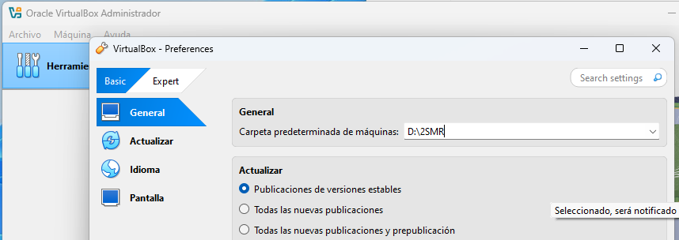
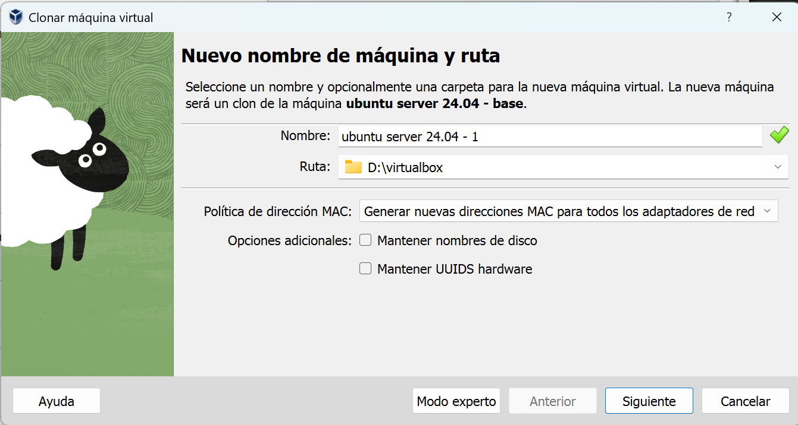
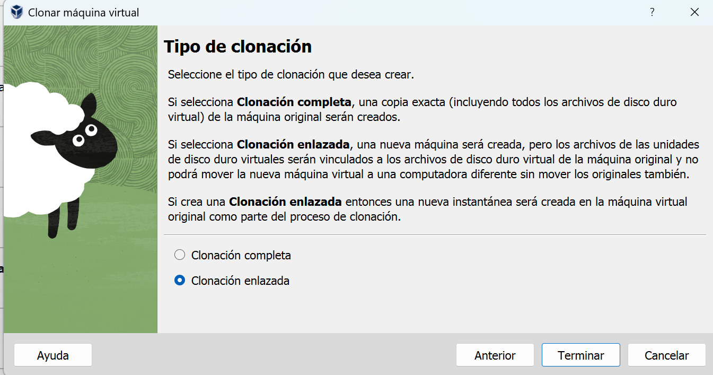

:::tip{}
En este curso, las actividades se realizarán con Ubuntu Server y Ubuntu Desktop versiones 26.04
:::

A partir de las máquinas base de Ubuntu Desktop y Ubuntu Server en VirtualBox, crea una clonación enlazada de cada una y genera nuevas direcciones MAC para todos sus adaptadores.

:::tip{}
Una clonación enlazada reutiliza el disco base y reduce el espacio ocupado. Ten cuidado de no usar la misma MAC en varias máquinas ya que se producirá problemas en la comunicación a través de la red.
:::

:::task{id="crear-maquinas" required="true"}
1. Antes de clonar, abre **Archivo → Preferencias → General** y configura la carpeta predeterminada de máquinas como `D:\2smr`.

2. Haz clic derecho sobre la máquina base de Ubuntu Desktop y selecciona **Clonar**. En el asistente, escribe un nombre que permita identificar el equipo, por ejemplo, `ubuntu-desktop-red`, confirma la ruta y selecciona **Generar nuevas direcciones MAC para todos los adaptadores de red**.

3. En la pantalla **Tipo de clonación**, selecciona **Clonación enlazada** y termina el asistente.

4. Repite los mismos pasos con la máquina base de Ubuntu Server y asígnale un nombre como `ubuntu-server-gateway`.
:::

:::evidence{id="captura-maquinas" type="screenshot" required="true"}
Adjunta una captura de VirtualBox donde se vean las dos máquinas creadas.
:::
