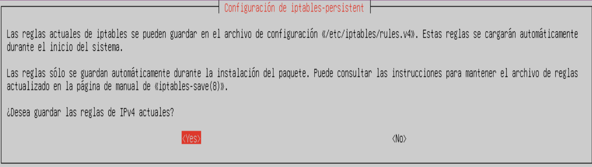

La red `192.168.1.0/24` usa direcciones privadas. El servicio NAT ejecutado con el parámetro `MASQUERADE`, sustituye la dirección ip de origen del cliente por la ip de la interfaz externa del servidor.

:::task{id="configurar-nat" required="true"}
1. Sustituye `enp0s3` si tu interfaz de salida tiene otro nombre y añade la regla NAT:

```bash
sudo iptables -t nat -A POSTROUTING -o enp0s3 -j MASQUERADE
```

2. Desde Ubuntu Desktop, confirma que el cliente ya puede acceder a Internet:

```bash
ping 8.8.8.8
```
:::

Si se reiniciara el servidor, se perderían las reglas configuradas con iptables, porque los cambios no se conservan de forma permanente. Para mantenerlas después de cada reinicio, instalaremos el paquete iptables-persistent. Este paquete guarda las reglas en archivos de configuración y las vuelve a aplicar automáticamente al iniciar el sistema.


:::task{id="persistir-reglas-iptables" required="true"}
1. Instala `iptables-persistent` para conservar las reglas después de reiniciar:

```bash
sudo apt install iptables-persistent
```




2. Guarda la configuración actual y consulta las reglas almacenadas:

```bash
sudo netfilter-persistent save
sudo iptables-save
```
:::

Las reglas persistentes se guardan en `/etc/iptables/rules.v4`. Si las modificas después de instalar `iptables-persistent`, vuelve a ejecutar `sudo netfilter-persistent save` para no perderlas al reiniciar.

Solo en el caso que quieras borras las reglas de iptables, usa:

```bash
sudo iptables -F
sudo iptables -t nat -F
```

:::warning{}
Activar `ip_forward` sin una regla NAT no basta: el cliente reenviará paquetes, pero las redes externas no sabrán cómo devolver tráfico a su dirección privada.
:::
