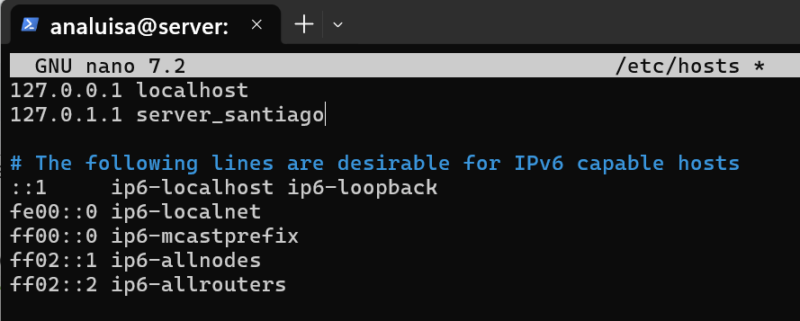

El hostname identifica a tu servidor en la red. Personalizarlo facilita distinguir tu máquina del resto del aula.

:::task{id="cambiar-hostname" required="true"}
Cambia el hostname y actualiza `/etc/hosts`.
:::

```bash
sudo hostnamectl set-hostname server_[tu_nombre]
sudo nano /etc/hosts
```

Busca la línea que contiene el hostname antiguo tras `127.0.1.1` y cámbiala por:

```
127.0.1.1 server_[tu_nombre]
```



:::task{id="reiniciar-hostname" required="true"}
Reinicia el servidor y vuelve a conectar por SSH para verificar el nuevo prompt.
:::

```bash
sudo reboot
```

```powershell
ssh analuisa@localhost -p 2222
```

:::evidence{id="captura-hostname" type="screenshot" required="true"}
Captura del resultado de `hostnamectl` mostrando tu hostname personalizado.
:::
