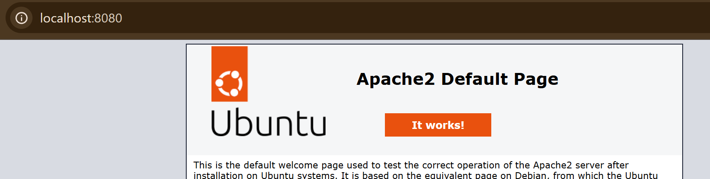
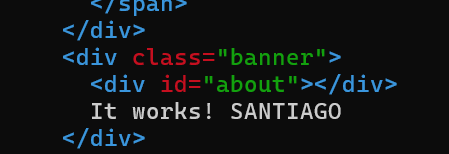

Apache HTTP Server recibe peticiones HTTP de los navegadores y responde con páginas web, imágenes y otros recursos.

:::task{id="instalar-apache" required="true"}
Instala Apache y verifica que el servicio está activo y habilitado al arranque.
:::

```bash
sudo apt install -y apache2
sudo systemctl status apache2
sudo systemctl is-enabled apache2
```

:::task{id="probar-apache" required="true"}
Abre el navegador en el anfitrión y visita `http://localhost:8080`. Deberías ver la página por defecto de Apache.


:::

:::task{id="personalizar-index" required="true"}
Edita `/var/www/html/index.html` para que aparezca tu nombre tras el texto `It works!`.

Recarga la página y comprueba que aparece tu nombre en el recuadro naranja:


:::

```bash
sudo nano /var/www/html/index.html
```

:::question{id="documentroot-apache" type="short-text" required="true"}
¿Cuál es el DocumentRoot por defecto de Apache en Ubuntu?
:::

:::evidence{id="captura-apache" type="screenshot" required="true"}
Captura del navegador mostrando la página de Apache personalizada con tu nombre.
:::
