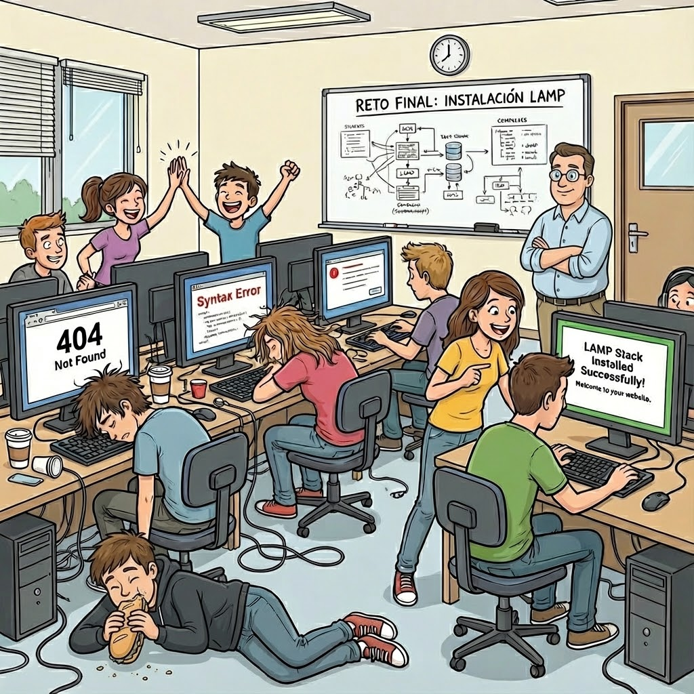

:::reflection{id="reflexion-final" required="true"}
¿Qué parte te ha resultado más compleja: la preparación del entorno virtual, la configuración del firewall, la instalación de PHP-FPM o la gestión de permisos de MariaDB? ¿Qué revisarías antes si tuvieras que repetir la práctica desde cero?
:::

:::task{id="exportar-aulawork" required="true"}
Exporta tu trabajo en formato `.aulawork` antes de cerrar la actividad.
:::

Recuerda incluir todas las evidencias solicitadas y comprobar que el nombre del archivo exportado sigue el patrón de la actividad.

