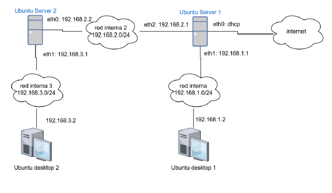

## Objetivos de la práctica

- Configurar un servidor DHCP con Kea en Ubuntu Server 2.
- Repartir direcciones IP dinámicas en la red interna 3 (`192.168.3.0/24`).
- Ampliar la configuración para dar servicio también en la red interna 2 (`192.168.2.0/24`).
- Crear una reserva de IP fija para Ubuntu Server 1 en la red interna 2.
- Atender la red interna 1 (`192.168.1.0/24`) con Kea desde Ubuntu Server 2 mediante un relay DHCP instalado en Ubuntu Server 1.

## Escenario de la topología

Según la topología ya desplegada en VirtualBox:

- Ubuntu Server 1:
  - `eth0`: DHCP (internet)
  - `eth1`: `192.168.1.1` (red interna 1)
  - `eth2`: `192.168.2.1` (red interna 2)
- Ubuntu Server 2 (servidor DHCP):
  - `eth0`: `192.168.2.2` (red interna 2)
  - `eth1`: `192.168.3.1` (red interna 3)
- Ubuntu Desktop 1: `192.168.1.2` inicialmente estática (red interna 1); al final pasará a DHCP y obtendrá una dirección de Kea mediante Server 1.
- Ubuntu Desktop 2: red interna 3; obtendrá por DHCP una dirección del rango `192.168.3.100–192.168.3.200` (no conservará `192.168.3.2` si estaba configurada manualmente).

La dirección `192.168.1.2` que aparece en el esquema representa el **estado inicial** de Ubuntu Desktop 1, no la dirección que conservará al activar DHCP.

:::note{}
La identificación de las interfaces de cada red interna forma parte de las tareas posteriores.
:::

:::warning{}
Haz las pruebas en redes internas aisladas de VirtualBox. No conectes Kea a una red compartida donde ya haya otro servidor DHCP.
:::
