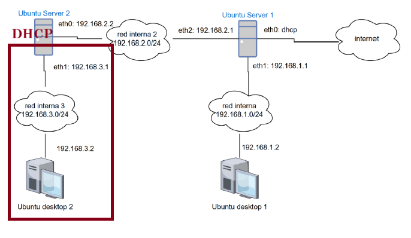

El servidor DHCP Kea se instalará en **Ubuntu Server 2** y, en este paso, entregará direcciones a los equipos de la **red interna 3 (192.168.3.0/24)**.

La primera configuración de Kea repartirá direcciones en la red interna **192.168.3.0/24**.

El nombre `enp0s8` del ejemplo es orientativo y puede diferir del de Ubuntu Server 2.

### Configuración base de Kea

```json
{
  "Dhcp4": {
    "interfaces-config": {
      "interfaces": [ "enp0s8" ]
    },
    "lease-database": {
      "type": "memfile",
      "persist": true,
      "name": "/var/lib/kea/kea-leases4.csv"
    },
    "subnet4": [
      {
        "id": 1,
        "subnet": "192.168.3.0/24",
        "pools": [
          { "pool": "192.168.3.100 - 192.168.3.200" }
        ],
        "option-data": [
          { "name": "routers", "data": "192.168.3.1" },
          { "name": "domain-name-servers", "data": "8.8.8.8" }
        ]
      }
    ]
  }
}
```

### Qué significa cada parámetro

| Parámetro | Función en esta práctica |
|---|---|
| `Dhcp4` | Agrupa la configuración del servidor DHCP para IPv4. |
| `interfaces-config.interfaces` | Enumera las interfaces donde Kea recibe solicitudes DHCP. Debe incluir la interfaz de la red interna 3, no la conectada a otra red. |
| `lease-database.type: memfile` | Guarda las concesiones en el backend de archivo de Kea, sin base de datos externa. |
| `lease-database.persist: true` | Conserva las concesiones en disco para recuperarlas tras reiniciar el servicio. |
| `lease-database.name` | Ruta del archivo CSV de concesiones; **no** es el archivo de configuración. |
| `subnet4` y `subnet` | Definen las redes IPv4 atendidas; aquí, `192.168.3.0/24`. |
| `id` | Identificador numérico único y positivo de esta subred dentro de la configuración de Kea. Se asigna `1` a `192.168.3.0/24`; conserva ese ID al ampliar la configuración y no lo reutilices para otra subred. |
| `pools.pool` | Delimita las direcciones **dinámicas** que se pueden conceder: `.100` a `.200`. |
| `option-data.name: routers` y `data` | Anuncian `192.168.3.1` como puerta de enlace al cliente. Esto no activa por sí solo el enrutamiento ni el acceso a Internet. |
| `option-data.name: domain-name-servers` y `data` | Anuncian `8.8.8.8` como DNS; su uso requiere conectividad hacia ese servidor. |

Kea selecciona la subred adecuada según la red por la que llega la solicitud. Una interfaz en `interfaces-config` **no sustituye** a la definición de `subnet4`.

:::task{id="configurar-subred-3" required="true"}
En Ubuntu Server 2, identifica la interfaz de la red interna 3 con `ip -br link`. Este respaldo y renombrado es una **inicialización de una sola vez**: conserva el archivo predeterminado del paquete antes de crear la configuración de la práctica en la ruta original. Primero ejecuta `test` para comprobar que no exista ya `/etc/kea/kea-dhcp4.conf.default.bak`. Si el comando no termina correctamente, **detente**: no des por hecho que el `mv` se realizó ni sobrescribas ese respaldo; inspecciona ambos archivos, conserva cualquier configuración actual y elige un nombre de respaldo distinto antes de continuar. Solo si la comprobación confirma que el nombre está libre, ejecuta el `mv`; luego pega el ejemplo completo anterior en `/etc/kea/kea-dhcp4.conf`, sustituyendo `enp0s8` por la interfaz real; confirma que el pool es `192.168.3.100 - 192.168.3.200`. Valida y revisa el resultado antes de reiniciar. Si editar o validar falla, detente, corrige o recupera la configuración y no reinicies hasta que la validación pase:

```bash
ip -br link
sudo test ! -e /etc/kea/kea-dhcp4.conf.default.bak
echo $?
```
Continúa solo si `echo $?` muestra `0`, que significa que el nombre de respaldo está libre. Si muestra otro valor, detente e inspecciona los archivos; no ejecutes `mv` ni continúes con la edición.

```bash
sudo mv /etc/kea/kea-dhcp4.conf /etc/kea/kea-dhcp4.conf.default.bak
sudo nano /etc/kea/kea-dhcp4.conf
```
Después de guardar el archivo, valida la configuración y revisa la salida. **No reinicies si Kea informa un error.**

```bash
sudo -u _kea kea-dhcp4 -t /etc/kea/kea-dhcp4.conf
```
Solo si la validación termina sin errores, reinicia Kea y comprueba el estado:

```bash
sudo systemctl restart kea-dhcp4-server
systemctl status kea-dhcp4-server --no-pager
```
Ejecuta cada comando por separado. Si necesitas recuperar el archivo predeterminado, restáuralo con `mv`:

```bash
sudo mv /etc/kea/kea-dhcp4.conf.default.bak /etc/kea/kea-dhcp4.conf
```
Valida el archivo restaurado y comprueba que no haya errores:

```bash
sudo -u _kea kea-dhcp4 -t /etc/kea/kea-dhcp4.conf
```
Solo si la validación pasa, reinicia Kea y consulta su estado:

```bash
sudo systemctl restart kea-dhcp4-server
systemctl status kea-dhcp4-server --no-pager
```

La tarea termina cuando la prueba ejecutada como usuario `_kea` no informa errores y `systemctl status kea-dhcp4-server` muestra `active (running)`. `systemctl status` consulta el estado y los mensajes recientes; `sudo systemctl restart kea-dhcp4-server` vuelve a iniciar el servicio para que cargue la configuración editada.
:::

:::warning{}
La interfaz de red puede no llamarse igual en todos los equipos. Verifica el nombre real antes de guardar la configuración.
:::

:::question{id="rango-subred-3" type="short-text" required="true"}
¿Qué rango de direcciones debe entregar Kea en esta primera parte?
:::

:::evidence{id="captura-config-subred3" type="screenshot" required="true"}
Captura de la configuración de Kea o del fragmento relevante del archivo `kea-dhcp4.conf`.
:::
