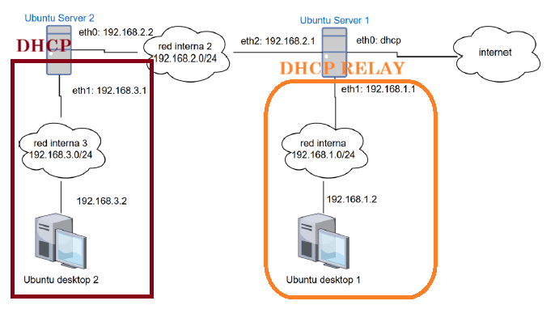
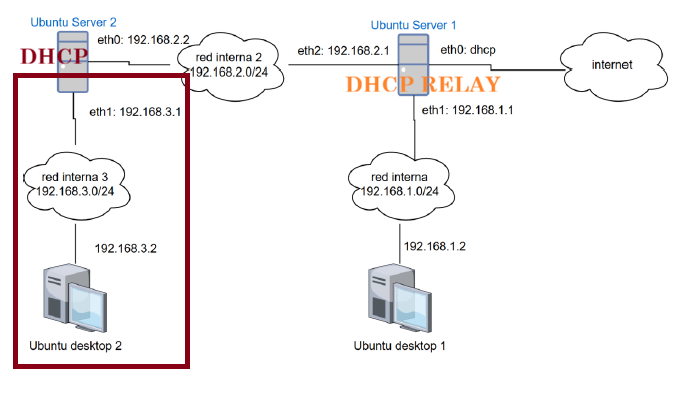

Kea seguirá instalado **solo en Ubuntu Server 2**. Para atender también `192.168.1.0/24`, Ubuntu Server 1 reenviará las solicitudes DHCP de la red interna 1 hacia Kea por la red interna 2.

El recorrido será: **Ubuntu Desktop 1 → Ubuntu Server 1 (relay) → Ubuntu Server 2 (Kea)**. El relay no asigna direcciones; Kea decide qué dirección ofrecer.

:::note{}
El esquema de la presentación muestra `192.168.1.2` en Ubuntu Desktop 1 como configuración **inicial estática**. En esta fase cambiarás ese cliente a DHCP para comprobar una concesión nueva.
:::

### 1. Amplía Kea con la red remota

Añade este **tercer objeto** al array `subnet4` de `/etc/kea/kea-dhcp4.conf` en Ubuntu Server 2. Los comentarios `// NUEVA SUBRED...` son marcadores visuales, no parámetros DHCP. Para consultar cómo queda el archivo completo después del cambio, despliega la configuración de referencia. Las interfaces `enp0s8` y `enp0s3`, y la MAC de ejemplo de esa referencia son ilustrativas: conserva en tu archivo los nombres reales y la MAC que obtuviste en los pasos anteriores. No sobrescribas ciegamente tu configuración; incorpora el objeto nuevo y conserva las subredes y la reserva existentes.

```json
{
  // NUEVA SUBRED: red interna 1 (añadir este objeto al array subnet4)
  "id": 3,
  "subnet": "192.168.1.0/24",
  "pools": [
    { "pool": "192.168.1.100 - 192.168.1.150" }
  ],
  "option-data": [
    { "name": "routers", "data": "192.168.1.1" }
  ]
  // FIN NUEVA SUBRED
}
```

:::details{summary="Ver configuración completa de Kea"}

Configuración final de referencia. Sustituye las interfaces y la MAC ilustrativas por las reales de tu práctica; los comentarios solo delimitan visualmente el objeto que se añade.

```json
{
  "Dhcp4": {
    "interfaces-config": {
      "interfaces": [ "enp0s8", "enp0s3" ]
    },
    "lease-database": {
      "type": "memfile",
      "persist": true,
      "name": "/var/lib/kea/kea-leases4.csv"
    },
    "subnet4": [
      {
        "id": 1,
        "subnet": "192.168.3.0/24",
        "pools": [
          { "pool": "192.168.3.100 - 192.168.3.200" }
        ],
        "option-data": [
          { "name": "routers", "data": "192.168.3.1" },
          { "name": "domain-name-servers", "data": "8.8.8.8" }
        ]
      },
      {
        "id": 2,
        "subnet": "192.168.2.0/24",
        "pools": [
          { "pool": "192.168.2.100 - 192.168.2.150" }
        ],
        "reservations": [
          {
            "hw-address": "08:00:27:de:ad:be",
            "ip-address": "192.168.2.1"
          }
        ]
      },
      // NUEVA SUBRED: red interna 1
      {
        "id": 3,
        "subnet": "192.168.1.0/24",
        "pools": [
          { "pool": "192.168.1.100 - 192.168.1.150" }
        ],
        "option-data": [
          { "name": "routers", "data": "192.168.1.1" }
        ]
      }
      // FIN NUEVA SUBRED
    ]
  }
}
```

:::

| Parámetro | Función |
|---|---|
| `subnet` | Declara la red remota que Kea atenderá mediante el relay. |
| `id` | Asigna el ID único `3` a esta tercera subred. Los ID de las otras redes se mantienen: `1` para `192.168.3.0/24` y `2` para `192.168.2.0/24`. Deben ser enteros positivos, únicos y conservarse al ampliar la configuración. |
| `pools.pool` | Limita las concesiones dinámicas a `192.168.1.100–192.168.1.150`; la IP `192.168.1.1` de Server 1 queda fuera. |
| `option-data` / `routers` | Indica al cliente su puerta de enlace, `192.168.1.1`. Anunciarla **no habilita por sí mismo** el acceso a Internet. |

Kea elige esta subred por la dirección de relay `giaddr` (`192.168.1.1`) que añade Ubuntu Server 1. La red 1 **no pertenece** a `interfaces-config.interfaces`: Ubuntu Server 2 no tiene una interfaz conectada a ella. En esta topología tampoco hace falta una cláusula `relay` adicional en Kea.

:::task{id="configurar-subred-relay" required="true"}
En Ubuntu Server 2, guarda una copia del archivo una sola vez, añade el tercer objeto conservando los anteriores y sus comas JSON, y valida **antes** de reiniciar. Ejecuta cada comando por separado y revisa la salida de la validación; si detecta un error, corrígelo sin reiniciar Kea. Reinicia solo después de una validación correcta y comprueba luego el estado.

```bash
sudo cp --archive --no-clobber /etc/kea/kea-dhcp4.conf /etc/kea/kea-dhcp4.conf.pre-relay.bak
sudo nano /etc/kea/kea-dhcp4.conf
```
Valida el archivo y revisa la salida. Si Kea informa un error, corrígelo y vuelve a validar; no reinicies hasta que pase.

```bash
sudo -u _kea kea-dhcp4 -t /etc/kea/kea-dhcp4.conf
```
Solo después de una validación correcta, reinicia Kea y consulta su estado:

```bash
sudo systemctl restart kea-dhcp4-server
systemctl status kea-dhcp4-server --no-pager
```

Si la validación pasa pero el reinicio falla, consulta `sudo journalctl -u kea-dhcp4-server -n 40 --no-pager`, restaura la configuración anterior, valídala y reiníciala solo si la prueba pasa. Comprueba de nuevo que está activa. Ejecuta cada comando por separado:

```bash
sudo cp /etc/kea/kea-dhcp4.conf.pre-relay.bak /etc/kea/kea-dhcp4.conf
```
Valida la configuración restaurada y revisa la salida:

```bash
sudo -u _kea kea-dhcp4 -t /etc/kea/kea-dhcp4.conf
```
Solo si la validación pasa, reinicia Kea y comprueba su estado:

```bash
sudo systemctl restart kea-dhcp4-server
systemctl status kea-dhcp4-server --no-pager
```

No continúes con el relay hasta corregir el fallo y volver a tener la nueva configuración válida, Kea `active` y las tres subredes definidas.
:::

### 2. Revisa los requisitos de red ya configurados

La ruta de retorno de Ubuntu Server 2 hacia `192.168.1.0/24` y el reenvío IPv4 de Ubuntu Server 1 ya se configuraron en la actividad previa de redes. No los vuelvas a modificar aquí. El relay gestiona los mensajes DHCP de descubrimiento, oferta, solicitud y confirmación (DORA), pero no sustituye el enrutamiento IP general: durante la renovación T1, el cliente puede comunicarse directamente por unicast con Kea usando la ruta y el reenvío ya preparados. Esto no implica NAT ni garantiza acceso a Internet.

### 3. Instala y configura el relay en Ubuntu Server 1



¿Por qué hace falta un relay en Ubuntu Server 1? Un cliente que aún no tiene una dirección IP envía un `DHCPDISCOVER` como broadcast local para encontrar un servidor. Ese broadcast se queda en `192.168.1.0/24`: los routers no lo reenvían a la red `192.168.2.0/24`, donde está Kea. Sin relay, Kea no recibe la solicitud inicial y el cliente no obtiene una concesión.

`isc-dhcp-relay` salva ese límite entre subredes, pero no convierte el broadcast en tráfico de difusión que atraviese routers. El flujo es:

1. El relay recibe el broadcast del cliente por la interfaz downstream de la red 1 (`-id`).
2. Lo reenvía como unicast al servidor indicado en `SERVERS` (`192.168.2.2`), usando la interfaz upstream de la red 2 (`-iu`), y establece `giaddr=192.168.1.1`.
3. Kea usa `giaddr` para reconocer que la solicitud corresponde a `192.168.1.0/24`, elegir el pool adecuado y enviar su respuesta a esa dirección del relay.
4. El relay recibe la respuesta en Server 1 y la entrega al cliente en la red 1, según el comportamiento DHCP del cliente; esa entrega local no depende de que un router propague broadcasts entre redes.

Los papeles siguen separados: **Kea es el servidor DHCP**, selecciona el pool y concede la dirección; **`isc-dhcp-relay` solo transporta las solicitudes y respuestas entre el cliente y Kea**. El flujo sigue el procedimiento de relay descrito en [RFC 2131, secciones 4.1 y 4.3](https://www.rfc-editor.org/rfc/rfc2131.html).

El paquete configura su servicio desde `/etc/default/isc-dhcp-relay`:

| Parámetro | Valor/función en esta práctica |
|---|---|
| `SERVERS` | Dirección del servidor DHCP Kea: `192.168.2.2`. |
| `INTERFACES` | Se deja vacío; así no se añaden listeners genéricos `-i` aparte de las interfaces delimitadas con `-id` y `-iu`. |
| `OPTIONS` | Incluye `-id <interfaz-red-1> -iu <interfaz-red-2>` para definir respectivamente la interfaz downstream que recibe clientes y la upstream que llega a Kea. |

Los nombres `eth1` y `eth2` del diagrama son ejemplos; comprueba los nombres reales en Ubuntu Server 1 y sustitúyelos. No incluyas la interfaz conectada a Internet como interfaz downstream ni upstream.

:::task{id="instalar-configurar-relay" required="true"}
En Ubuntu Server 1, identifica las interfaces con `ip -br -4 address` y distingue la conectada a `192.168.1.0/24` de la conectada a `192.168.2.0/24`. Instala `isc-dhcp-relay`; si aparece el diálogo del paquete, indica `192.168.2.2` como servidor DHCP y las interfaces de las redes 1 y 2. Luego guarda una copia del archivo de configuración y revisa `/etc/default/isc-dhcp-relay` para que los tres parámetros queden así, sustituyendo `<interfaz-red-1>` y `<interfaz-red-2>` por los nombres reales:

```conf
SERVERS="192.168.2.2"
INTERFACES=""
OPTIONS="-id <interfaz-red-1> -iu <interfaz-red-2>"
```

`-id` marca la interfaz downstream que recibe las solicitudes broadcast de los clientes; `-iu` marca la interfaz upstream desde la que se contacta con Kea. Mantén fuera la interfaz de Internet. Reinicia el servicio y comprueba su estado y registros:

```bash
sudo apt update
sudo apt install isc-dhcp-relay
sudo cp /etc/default/isc-dhcp-relay /etc/default/isc-dhcp-relay.pre-relay.bak
sudo nano /etc/default/isc-dhcp-relay
sudo systemctl restart isc-dhcp-relay
systemctl status isc-dhcp-relay --no-pager
sudo journalctl -u isc-dhcp-relay -n 30 --no-pager
```

Si el servicio no arranca, usa los registros para corregir la dirección del servidor o los nombres de interfaz y vuelve a reiniciar. Para deshacer la edición, restaura la copia, revisa sus valores —los predeterminados del instalador pueden no servir para esta práctica— y reinicia:

```bash
sudo cp /etc/default/isc-dhcp-relay.pre-relay.bak /etc/default/isc-dhcp-relay
sudo nano /etc/default/isc-dhcp-relay
sudo systemctl restart isc-dhcp-relay
systemctl status isc-dhcp-relay --no-pager
```

La tarea termina cuando `isc-dhcp-relay` está `active` y no muestra errores de interfaces o de arranque. Para Kea, `systemctl status kea-dhcp4-server` consulta su estado y `sudo systemctl restart kea-dhcp4-server` reinicia el servicio para cargar los cambios validados.
:::

### 4. Comprueba la concesión desde la red interna 1

:::task{id="comprobar-cliente-relay" required="true"}
En Ubuntu Desktop 1, abre la configuración de la conexión de la red interna 1, cambia IPv4 de **Manual** a **Automático (DHCP)**, guarda y desactiva/activa esa conexión. Comprueba la dirección y la ruta desde una terminal:

```bash
ip -br -4 address
ip -4 route
ip -4 route get 192.168.2.2
```

La interfaz debe obtener una IP entre `192.168.1.100` y `192.168.1.150`, la puerta de enlace anunciada debe ser `192.168.1.1` y la ruta hacia Kea (`192.168.2.2`) debe pasar por `192.168.1.1`. **Conservar `192.168.1.2` no demuestra que el relay funcione**: sería la antigua dirección estática. Si no llega una concesión, revisa que el cliente esté en DHCP, que el relay esté `active`, que se mantengan los requisitos de ruta y reenvío configurados previamente, y consulta los registros en ambos servidores:

```bash
# En Ubuntu Server 1
sudo journalctl -u isc-dhcp-relay -n 40 --no-pager
# En Ubuntu Server 2
sudo journalctl -u kea-dhcp4-server -n 40 --no-pager
```
Cuando Desktop 1 reciba una IP del pool remoto, confirma en Ubuntu Server 2 que Kea registró esa concesión:

```bash
sudo grep -F 'IP_OBTENIDA' /var/lib/kea/kea-leases4.csv
```

Sustituye `IP_OBTENIDA` por la dirección entre `192.168.1.100` y `192.168.1.150`; comprueba que la fila corresponde al cliente de la red 1.
:::

:::checkpoint{id="relay-red-interna-1-operativo" required="true"}
Ubuntu Desktop 1 recibe por DHCP una dirección del pool `192.168.1.100–192.168.1.150` a través del relay; las redes internas 2 y 3 siguen funcionando.
:::

:::evidence{id="captura-relay-red-interna-1" type="screenshot" required="true"}
Adjunta una captura que muestre la IP obtenida por Ubuntu Desktop 1 y otra información que permita verificar el relay, como el estado del servicio en Ubuntu Server 1 o la concesión registrada por Kea.
:::
