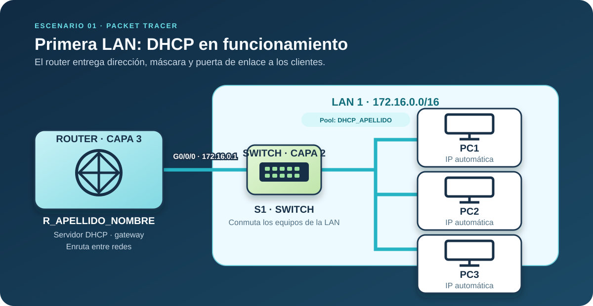

## Objetivo

Configurarás un router Cisco como servidor DHCP para dos LAN en Packet Tracer. La primera red será `172.16.0.0/16` y la segunda `192.168.1.0/24`.

## Antes de empezar

- Crea un router, un switch y tres PCs para la primera LAN.
- Conecta el router por `G0/0/0` al switch de la primera LAN.
- Añade una nota visible con tu nombre, grupo y código de clase.
- Cambia el nombre del router a `R_APELLIDO_NOMBRE`.

:::task{id="identificar-topologia" required="true"}
Monta la topología inicial e identifica el router con tu nombre.
:::

:::evidence{id="captura-topologia" type="screenshot" required="true"}
Captura de la topología inicial donde se vea el nombre del router y tu identificación.
:::
