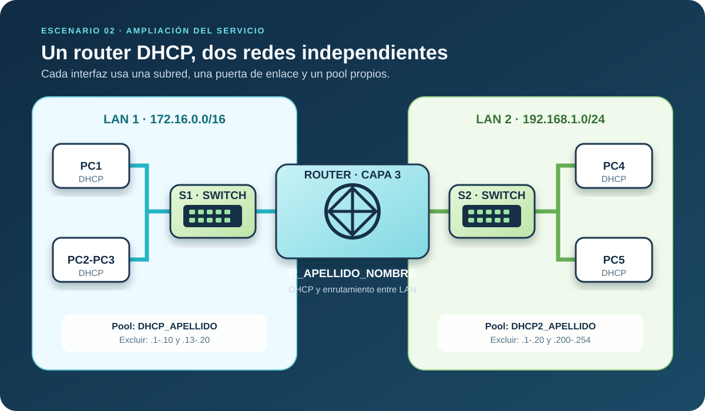

Conecta nuevos PCs al segundo puerto del router y repite el procedimiento para `192.168.1.0/24`.

Datos de la segunda LAN:

- Interfaz: `G0/0/1`.
- Dirección del router: `192.168.1.1/24`.
- Pool: `DHCP2_APELLIDO`.
- Direcciones excluidas: `.1-.20` y `.200-.254`.

:::task{id="configurar-segunda-lan" required="true"}
Configura y activa `G0/0/1`, crea el segundo pool, declara las exclusiones y configura los nuevos PCs para DHCP.
:::

:::question{id="rango-segunda-lan" type="short-text" required="true"}
Indica un rango válido que sí pueda recibir un cliente de la segunda LAN.
:::

:::evidence{id="segunda-lan-funcional" type="screenshot" required="true"}
Captura de un cliente de la segunda LAN con una dirección recibida por DHCP.
:::
